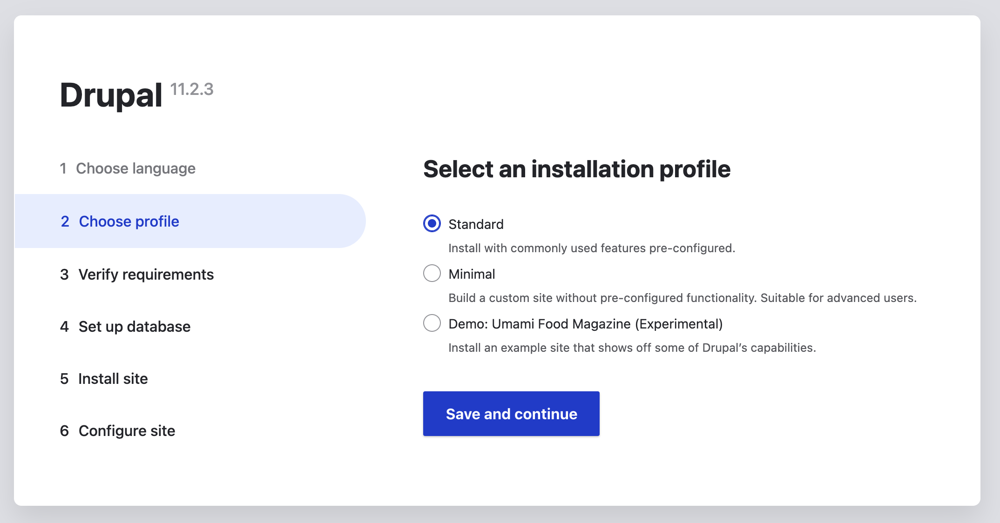
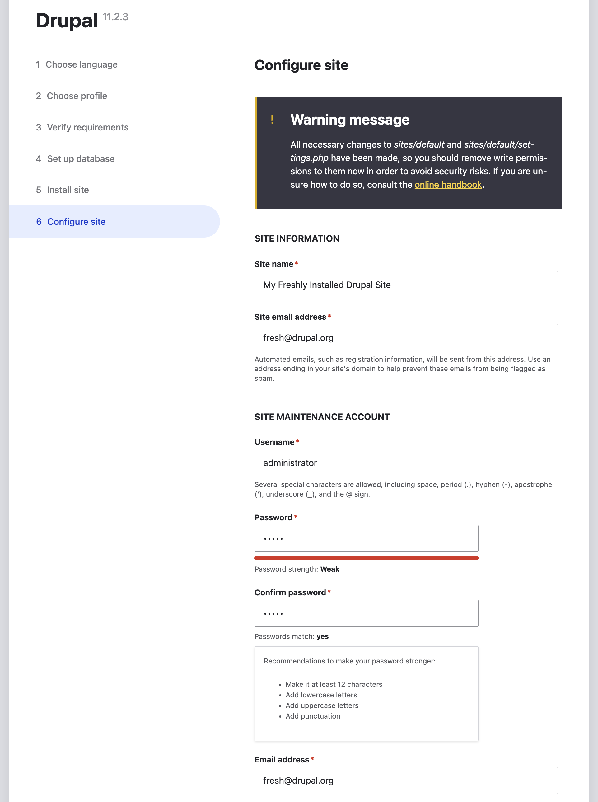

# Drupal Installation
There are multiple ways to install Drupal. You can download it as a .zip file and expand it into a folder on your 
computer, or you can install it via composer. 

[#SHADOW] Composer
One of the bigger things that were added in 8.x and forward was to use composer as a package manager, but composer is PHP's
de facto dependency manager. Think of it as a tool that keeps track of the libraries your PHP needs, automatically
downloads them and ensures they all play nicely together.

It manages dependencies by declaring the libraries your project needs in a `composer.json` file. When run, it downloads 
the dependencies into a `vendor/` folder. It handles version constrains so that you can specify different version of 
libraries to work with the compatibility of your code. It Autoloads the code with PSR-4/PSR-0 compliant autoloader, so
you don't need to `require`each  PHP file manually. Most modern PHP frameworks (Laravel, Symfony, Drupal) expect Composer
for installation. 

Composer also keeps everything reproducible. When you run composer for the first time, it will "bake" your recipe
(`composer.json`) into `composer.lock` file. In that file, the exact versions installed are stored so other developers
(or production servers) get the same setup. That also means that just a single person needs to update the dependencies
(by running `composer update`), others just need to install the latest dependencies (by running `composer install`) 
respectively. That avoids almost entirely the "works on my machine" problem.
[/#SHADOW]

We're going to leave the exploration of the zip files for you to discover and deep dive into composer.

## Install latest Drupal version with DDEV
To install a fresh installation of Drupal on your computer, you will need to do the following:
1. Create a folder for your project (`mkdir [PROJECT-NAME]`). I have chosen to have this folder under my user account, in a folder called `websites`, but you can put it where ever you want.
2. Go into the newly created folder (`cd [PROJECT-NAME]`)
3. Run this command: `ddev config --project-type drupal11 --project-name="PROJECT-NAME" --docroot="web"`. This will create a `.ddev` folder in your project folder. Please note that PROJECT-NAME can not include underscore (_) but can include a dash (-).
4. Run `ddev start` to create and setup the Docker containers. This will do multiple things, like setting up the PHP and MySQL containers and make Composer available to you.
5. Run `ddev composer create-project drupal/recommended-project`. This will fetch every file and other dependencies that Drupal needs for setup and run. We won't include a file list, since it will vary greatly from what we saw when writing this chapter.

Now we have all the files for Drupal to set up. But we haven't actually done that yet, we need more step, which we can do 
in two different ways!

You can set up Drupal via the Drush command line tool. Run `ddev drush si` (short for site install) and wait for few
moments. After the installer has finished you can run `ddev launch` to get to the front page or `ddev launch /user` if you
want to log in as an administrator right away.

You can also set up Drupal via the GUI tool provided by Drupal. Instead of following the procedure above, just run `ddev launch`
and the website will run in install mode. Follow the GUI questions and finish the setup.

A question with "Is it OK to DROP all tables in your 'db' database" might pop up. It's fine to say yes to that, IF you're 
installing the site for the first time. If you manage to get this process up with some data in the database (like if you
got a production server "dump"), it will actually remove all that data, so be careful ;-) 

### Continuing the install (GUI version)
Since `drush si` will finish the installation for you, we will now go over the steps for installing via the GUI. 

First of all, if you see this on your screen, it's highly possible that you forgot to run `composer create-project`

What you should see is this screen:

Choose whatever language you'd like. For accessibility’s sake, we're continuing with English. Press **Save and continue** to continue.

The next step is to select an installation profile. There are three that come with default Drupal: Standard, Minimal and 
the Umami Food Magazine Demo. Although we will not explore the Umami Food Magazine profile, we encourage you to take a look.

Continue with selecting **Standard**. Press **Save and continue**

Note that even if we just pressed save in Step 2, we are now in Step 6! Step 3 covers the verification of
requirements, the database is setup in Step 4 and the site installation is in Step 5. And since we're using
DDEV, these steps are all automatic.

The final step includes configuring the Site Information:

Fill out the form with your own data. The username can be anything you'd like. Same with the password, although Drupal
suggests that you use stronger password than **12345**. But that's fine for this site installation.

Two email addresses are required. The site's address, which will be used when **EXPLAINATION NEEDED** and then **Email address**
which is used to send email notifications to.

The last part of the form you can leave as is. It checks automatically for updates and notifies admins when updates are 
required. The **Receive email notifications** checkbox indicates that you would like to be notified via email
when security updates and other updates are published.

When you press **Save and continue** you should see the initial Drupal webpage as a logged-in user:

## Install Drupal CMS with DDEV
To install Drupal CMS on your computer, you only have to change one line in the previous list:
5. Run `ddev composer create-project drupal/cms`

## Starting and stopping DDEV containers
Whenever you are done working with your Drupal project, you can stop the containers with `ddev stop`. DDEV will keep the
application and you can pick up where you left off. To run stopped containers, run `ddev launch`, which will start your project
back up, plus launching your default web browser with your website.

## Install Drupal (and Drupal CMS) with Lando
TBA

