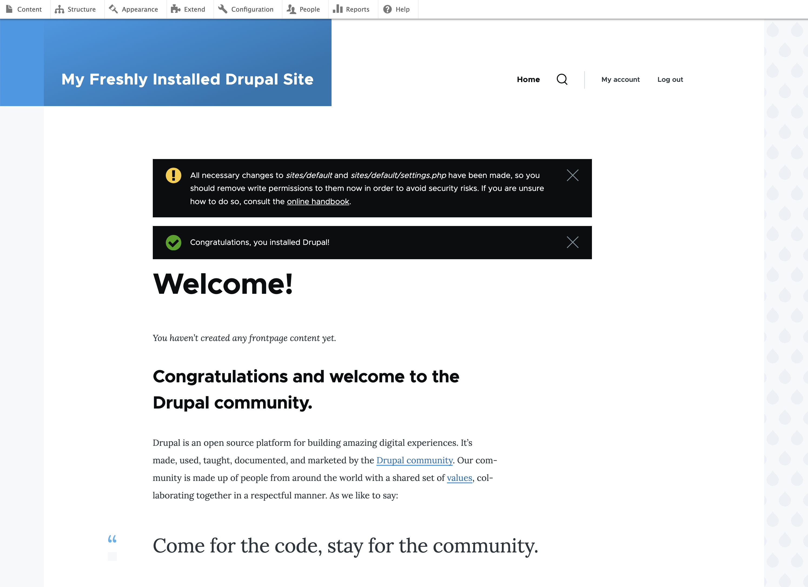

# Where do I begin?
After you first install either Drupal or Drupal CMS, it's very understandable that you might get overwhelmed. After all,
Drupal is an enterprise-level software and if you are not familiar with CMS systems in general, this is quite a bite
to take. But don't worry, we're here to guide you through the grapevine.

I've been teaching Drupal for a long time. And everytime when we start, I start with thinking: "Where do I really start?"
Because in order to explain "this", you really have to know about "that", and to really understand "that" you REALLY need 
to have basic knowledge of .... Hopefully you understand where I'm going with this.

So I've decided that I will just start at one logical place. Start explaining. Mention some terms on the fly. Sometimes I
will explain the side term in details, and sometimes I will come back to the topic later. I hope that when you're done reading
this book, it will all come together.

## What's a CMS (and why should I choose to use one)?
A CMS (Content Management System) is a software that lets people create, edit, organize and publish content like
text, images, videos, or even entire web pages, without having to code everything from scratch.

Its purpose is to make it easier for non-technical users (and technical ones too) to manage website content. Normally,
you will log in to an admin interface, add or update content through forms and editors, and the CMS stores and
displays it on your site.

Some of the biggest CMS systems are WordPress, Drupal, Joomla and Shopify. The first three are open-sourced software, but
Shopify is proprietary. 

Most CMSs have an Admin dashboard, where you manage content and settings, a database, which stores your content and 
metadata, templating system of some sort to determine how your site looks like and a plugin/module system to
add extra features to your site without you have to rewrite the core.

The opposite of using CMS would be using a plain (static) website. Maintaining such a website is a headache and a half, 
you would have to edit the HTML/CSS files directly and re-upload them, which also requires users to have knowledge of 
HTML and CSS, maybe even JavaScript.

The upside is that the website is superfast, since pages are prebuilt, but that's probably the only upside. If you're 
maintaining a site that has more than 4-5 pages, a CMS is always a wiser choice.

## Overview of the layout of a Drupal Site
So we have a fresh installation of Drupal (or Drupal CMS, they are interchangeable). What do we see here?

First of all, there is quite a big difference between a fresh installation of Drupal and The Drupal CMS, even if we didn't install
anything else than the core of Drupal CMS.

*Drupal 11 after installation*

*Drupal CMS (with Drupal 11 core) after installation*

Even though the look very different out-of-the-box, it's literally the same system. Just different setup. We will not cover 
the difference in great detail in this chapter, just be aware that it's the same system. Later we will adjust a vanilla 
Drupal install to look more like the Drupal CMS. But for now, we're going to explore Drupal CMS.

### The Building blocks of Drupal 
We can roughly divide the basic building blocks of Drupal into: Content types, taxonomy terms, menus, blocks, views and users. 
We then extend our site with themes and modules. The building blocks have one thing in common: They all **"extend the Entity
base class"**, which is a very technical term which I will explain later. Just be aware that they are all descendants of 
**"Entity"**. 

### Content types
Content types store data in a structured way. An example of a content type would be "Page". Another would be "News" and 
third might be "Events". By creating different content types for each type of content we are storing on our website
we can much easier customize how the content is viewed and displayed.

Events for example would have data regarding the start and end times and location of the event, even links to where to 
buy tickets, while a news article only has the publishing date as a relevant data. And normally we would not display
the creation date of a page, unless it's an article, and isn't that another content type?

All of them would probably share a text-area to enter some text information, a title or name is another shared field, the
user id of the person created the record etc.

### Taxonomy vocabularies and taxonomy terms
A taxonomy term is an individual item (or "label") within a taxonomy, which is a structured system for classifying and 
organizing content. The taxonomy defines the categories or tags that are available while the term is one of those categories
or tags. Multiple terms can belong to the same taxonomy, and content items can be assigned one or more terms to help 
with filtering, grouping and navigation.

For an example, you can have a Taxonomy vocabulary named "Colors" and then have the terms Red, Blue and Green within the
vocabulary. 

### Menus
Menus are a collection of links, displayed to the user to navigate your website. There are very often multiple menus per 
website. 

The Main menu is very often displayed on top of a website. The Footer menu on the other half is, according to the name, displayed
in the footer. We can also have User account menu, Administration menu and more. You can easily create your own
menus within Drupal. 

### Blocks
In Drupal, a block is a reusable chunk of content or functionality that can be placed into specific regions of your site's 
page layout. It's part of Drupal's theme system and is often used for sidebars, headers, footers, or any 
widget-like element.

It can be either completely static content or a mixture of statically and dynamically created data. One core-provided block
is *"Powered with Drupal"* block that displays **"Powered by Drupal"** on a web page. 

You can also create a block with *"Views"* (explained next) to display the five newest news articles or what
users are logged into the system. 

The Block system is quite ingenious. You can assign each block to a specific region, control its visibility so it only 
displays to logged-in users or only on the front page etc. The content of a block can be anything!

### Views
Views is a module that only appeared in Drupal Core in Drupal 8. Before that, Views was a contribution module, but since
overwhelmingly number of sites installed Views as their first contrib module, it was finally moved to core.

Views is in general the *"Data gathering tool".*  If you need a list of news articles, events that are upcoming,
displaying the archives of interesting articles or displaying a list of Hotels in the neighbourhood, you will use Views
to gather the data together. And then you will either create a Views Page or Views Block to display your data.

### Users
Users in Drupal can very roughly be divided into two groups: Anonymous and Authenticated users. An anonymous user is
one who navigates your page without having to log in. Which is normally most of the internet users in the world. 

Authenticated users are any user that requires a username and password to view and/or change content on the site. You can 
then divide authenticated users into user groups, each having different access and permissions to your site.

When you install Drupal, there is always one user that is created, and that's *"User 1"*, often also named
*"Administrator"* or *"Admin"*. User 1 is not only an Administrator, he's **THE** Administrator. A Superuser. User 1 can
bypass all access barriers you set up, which is in a way a good thing, but with great powers comes great 
responsibility. And sometimes User 1 is disabled for security reasons. 

## Themes
Themes are essentially the presentation layer of a Drupal website. It controls *how* content and interface
elements are visually displayed to the end user, without changing *what* it is or *how* the content is stored.

You can think of Drupal as a layered cake. The Core & the Modules handle the data, logic and features of the website (the 
*"cake"*) and the theme adds the *"frosting"*, layout, colors, typography and the visual style. 

Themes never change the content in the database nor do they handle business logic or data processing.

There are essentially two types of Themes, Admin themes and Front-end themes. Admin themes control the look
and feel of the "backend", when the user is logged in and is performing some administrative tasks. 

Front-end themes on the other half are the ones that display the "main content" to users, both anonymous and 
authenticated. 

And then the "hidden third", a theme that is a mixture of both, because today many content editors like to see what
they are doing in a WYSIWYG environment, so that the front-end theme can also render some backend elements.

### Core structure of a Drupal Theme
A Drupal theme is a collection of files in a folder, often under the `/themes/custom` for a custom-built 
theme or `/themes/contrib` for contributed ones. There is not really any difference between the two, except
that contributed themes are normally not stored in a versioning system (rather than being controlled by
Composer) but custom themes are, for obvious reasons. 

A minimal Drupal theme includes normally these components:
* `theme-name.info.yml` which defines the metadata of the theme. Name, description, regions of the theme, libraries to be included etc.
* `theme-name.libraries.yml` for CSS and JavaScript files to be loaded. 
* **Templates** (`.html.twig`) **files** that define the HTML markup for pages, blocks, nodes, menus and more. 
* `css/` and `js/` directories to hold style and script files
* An optional `theme-name.theme`, which is a PHP file for preprocess functions and logic that affects template variables.

Normally would the theming layer and theming be a separate book, but we will cover some general theming in this book.

## Modules
Modules extend the functionality of a Drupal website. There are three types of Modules: System, Contribution and 
Custom.

### System modules (Core modules)
System modules are part of Core. Some of them are very essential for Drupal to function. Like the User module. If you would 
uninstall the user module you would essentially not be able to log in to your site again, rendering it useless.

The Comment module is another system module. If enabled, it can allow users, anonymous and/or authenticated to make comments
on the content you offer. It is not enabled by default.

Drupal Core modules are developed and maintained by the Drupal core team.

[#HINT]
You can often distinguish a system module by it's version number, but they normally have the same version number as
the core you are running.
[/#HINT]

### Contribution modules
Contribution modules are extensions to Drupal, created by the users themselves and shared by the community, rather than 
being part of the Drupal Core. All modules on drupal.org are completely free, anyone can download and use them to extend
Drupal's functionality. 

Every single module has their own page on drupal.org and there you can read it's documentation, see the outstanding bugs
and even contribute to the module yourself. And if you have a feature request, just submit it through the project page,
and rather than waiting on someone to implement it, you can submit implementation yourself.

The purpose of contributional modules is to add features to a website that is not in core, such as SEO features, 
workflows, payment gateways etc. They can also integrate to third-party services such as Stripe, Google Analytics 
or Spotify, improve site building and administration with modules like Pathauto and Redirect and enhance user 
experience with Better Exposed Filters, Paragraphs and Webforms. Contrib module code is installed with composer 
(`composer require drupal/modulename`).

Some contrib modules are very mature and used in huge number of sites, like Pathauto, Token and Webform
while others only have handful of users with very few maintainers. Security coverage is provided to the contrib
modules if the project is opted to the Drupal Security Team's advisory process.

Contrib modules are central to Drupal's ecosystem They hold up the open-source community spirit that developers shoudl
share their solutions publicly so that site builders can pick and combine them to tailor their sites. With contrib 
modules, the ecosystem grows much faster than Drupal core could ever do.

### Custom modules
If you can't find a module that does whatever that it is that you want it to do, you could then just 
build it yourself! Custom modules range from simple addition of javascript/css or overrides to other modules, to 
custom entity modules that are tailored to your specific project and are not necessarily not suitable to be 
distributed openly. 

Later in this book we will learn how to create or own modules. 

## Conclusion
Now that we've mentioned a lot of technical terms, let's start diving into each of them in more detail!
